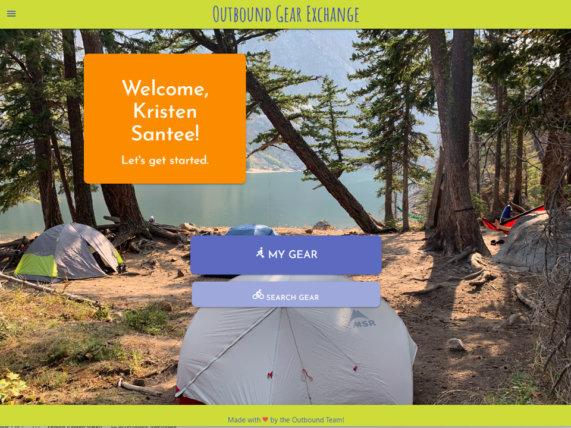

# Oubtound Gear Exchange

## Overview
Outbound Gear Exchange started as a collective of people who love the outdoors and wanted a space to be able to swap gear to take on new adventures and test out new gear setups. 

## Description
This application was designed to make outdoor activities more accessible by providing access to outdoor gear in your area. In this application, you can request gear or list gear available to swap including backpacking equipment, winter sports gear, and camping/hiking gear. You can use the site to view your cache of personal gear on the site and you can also search for gear by activity to explore the full OBE collection. Future development includes a possible marketplace for a commerce-based exchange, a bulletin board listing gear for sale or sought-after gear, and integration with local hiking apps like the WA Trail Association to connect gear with actual local trails. 

## Table of Contents

1. [Installation](#installation)
2. [Usage](#usage)
3. [Licenses](#licenses)
4. [Contributing](#contributing)
5. [Tests](#tests)
6. [Questions](#questions)

## Installation
A link to the deployed site can be found [here](https://outbound-gear-exchange.herokuapp.com/). The Github repo can be found [here](https://github.com/jlee12297/Outbound-Gear-Exchange). A screenshot of the site is shown below: 

## Usage
To access the developed application, the codebase can be cloned from github and accessed by installing all required dependencies. The email functionality also makes use of a dotenv file that is not included in the codebase. Required fields for the .env are the DB_NAME, DB-USER, DB-PASSWORD (required for MySQL), SESSION_SECRET, then the following for email: MAIL_USER, MAIL_FROM, MAIL_PASS, MAIL_HOST, MAIL_PORT.

## Licenses
This project uses the MIT license. More info about licenses can be found [here](https://choosealicense.com/).

## Contributing
This project is open for contribution but please initiate an issue for any significant changes. 

## Tests
This code does not feature testing instructions at this time.

## Questions
The project manager can be reached through [email](kristen.l.santee@gmail.com) or contacted through [Github](https://github.com/kristensantee) or [LinkedIn](https://linkedin.com/in/kristen-santee).
Front end developer: [Stevie Gomez](https://github.com/smariagomez)
Front end developer: [Leslie Saucedo](https://github.com/leslie310)
Back end developer: [Josh Lee](https://github.com/jlee12297)
